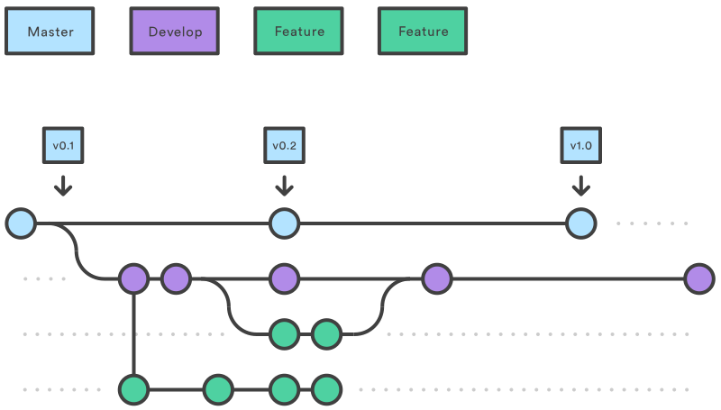

# 📌 Pinterior
> 인테리어 이미지를 핀으로 저장하고, 보드로 큐레이션하는 Pinterest 스타일 웹서비스

<br>

## 1. About Project
- **프로젝트 목적** : Pinterest를 레퍼런스로 한 클론 코딩 프로젝트로, 인테리어 이미지를 핀으로 등록하고 보드로 분류·큐레이션하는 풀스택 웹 서비스
- **레퍼런스** : [Pinterest](https://www.pinterest.co.kr/)
- **개발 기간** : 2026.05.04 ~ 2025.05.18 (14일)
- **특이사항**
  - 회원가입 없음 — 사전 등록된 테스트 계정으로만 로그인
  - 이미지 저장소는 S3 대신 Docker 볼륨 마운트 방식 사용
  - JWT 인증 (Refresh Token 없음 / DB 토큰 미저장)
 
<br>

## 2. Team Members (팀원 소개)

<table>
  <tbody>
    <tr>
      <td align="center">
        <a href="https://github.com/Minji6">
          
          <br />
          <sub><b>팀장 : 김민지</b></sub>
        </a>
        <br />
        <sub>FullStack</sub>
      </td>
      <td align="center">
        <a href="https://github.com/garden-kim-git">
          
          <br />
          <sub><b>팀원 : 김정원</b></sub>
        </a>
        <br />
        <sub>FullStack</sub>
      </td>
      <td align="center">
        <a href="https://github.com/KimHyo1">
          
          <br />
          <sub><b>팀원 : 김효</b></sub>
        </a>
        <br />
        <sub>FullStack</sub>
      </td>
      <td align="center">
        <a href="https://github.com/kennedy0919">
          
          <br />
          <sub><b>팀원 : 천승현</b></sub>
        </a>
        <br />
        <sub>FullStack</sub>
      </td>
    </tr>
  </tbody>
</table>


## 3. Key Features (주요 기능)

- **인증** — 이메일/비밀번호 로그인 및 로그아웃, JWT 기반 인증
- **유저** — 프로필 이미지·닉네임·비밀번호·소개 수정
- **핀** — 이미지·제목·설명·링크·태그를 포함한 핀 등록·조회·수정·삭제 및 이미지 다운로드
- **보드** — 핀을 분류·저장하는 보드 생성·조회·수정·삭제
- **핀 저장** — 핀을 보드에 저장하거나 기본 저장함에 보관
- **댓글** — 핀 상세 페이지에서 댓글 작성·조회·수정·삭제
- **검색 · 태그** — 핀 제목 및 태그 키워드 검색, 최근 검색어 관리

<br>

## 4. ERD
사진 첨부 예

## 5. Technology Stack (기술 스택)
**Backend**


**Frontend**


**Database**


**Infra**


**Tools**


## 6. Development Workflow (개발 워크플로우)
### 브랜치 전략
Git Flow를 기반으로 하되, 단기 프로젝트 규모에 맞게 `release`·`hotfix` 브랜치는 생략합니다.


| 브랜치 | 역할 | 규칙 |
|--------|------|------|
| `main` | 최종 배포본 | 직접 push 금지, dev에서만 머지 |
| `dev` | 통합 개발 | feat/* PR 리뷰 후 머지 |
| `feat/{기능명}` | 기능 단위 개발 | 완료 후 dev로 PR |

### PR 규칙

- `feat/*` → `dev` PR 생성 후 **팀원 2명 이상 리뷰** 후 머지
- PR 제목 형식 : `[feat] 핀 등록 API 구현`
- `dev` → `main` 은 전체 기능 완료 후 최종 1회 머지

<br>

## 7. Convention (컨벤션)
### 네이밍 규칙

| 대상 | 규칙 | 예시 |
|------|------|------|
| 클래스명 | PascalCase | `PinController` |
| 메서드 · 변수명 | camelCase | `getPinById` |
| DB 컬럼명 | snake_case | `board_id`, `created_at` |
| 브랜치명 | kebab-case | `feat/pin-crud` |

### 커밋 컨벤션

```
[feat] : 핀 등록 API 구현

[목적]: 이미지 포함 핀 생성 기능 구현

[목표]: 이미지 업로드 후 Docker 볼륨에 저장, Pin 테이블에 레코드 생성

[달성도]:
  - 이미지 업로드 및 저장 완료
  - 제목 · 설명 · 링크 · 태그 저장 완료

[기타]: 이미지 용량 제한 및 형식 검증 추가 필요 (400 처리)
```
**커밋 타입**

| 타입 | 설명 |
|------|------|
| `feat` | 새로운 기능 추가 |
| `fix` | 버그 수정 |
| `refactor` | 코드 리팩토링 |
| `docs` | 문서 수정 |
| `chore` | 빌드 설정, 패키지 수정 등 |
| `style` | 코드 포맷팅, 세미콜론 누락 등 |
